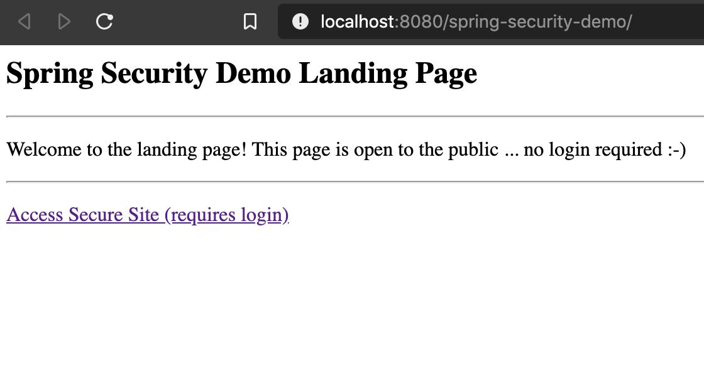
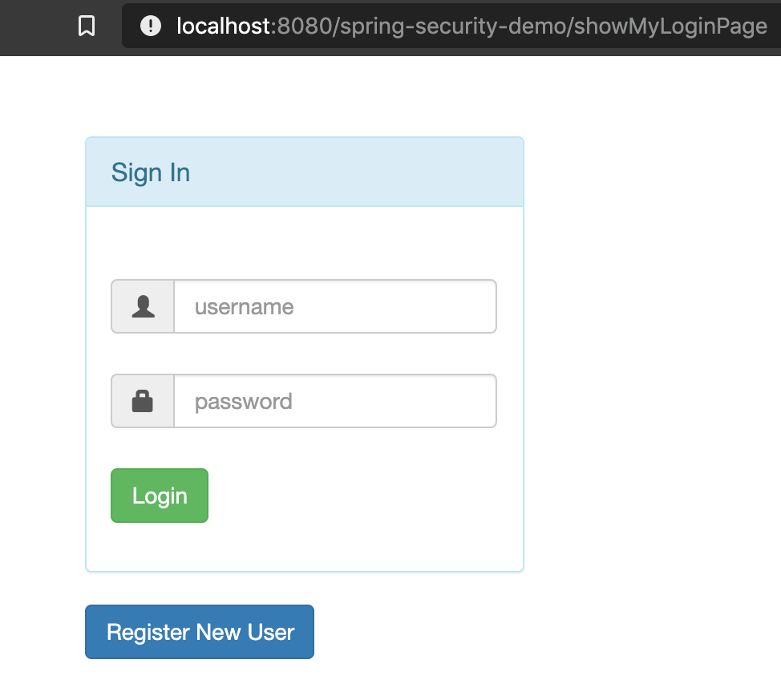
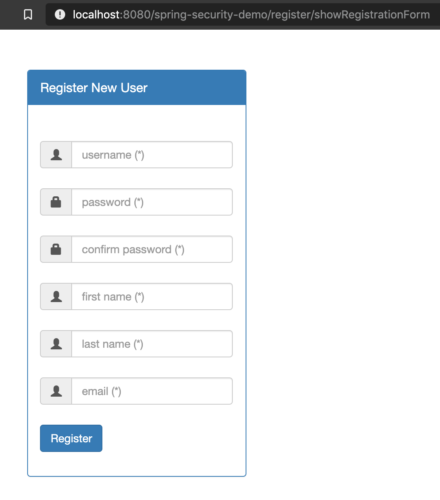

# spring-security

This app implements the basic features of Spring Security user roles. Passwords
are stored in the database using Bcrypt hashing. To create the database, use the sql
file located in: `/src/main/resources/sql`

#### To run:
You can configure Tomcat to run in IntelliJ, Eclipse or on the command line as shown below.
```
$ gradle clean build
```
Copy the war file to the webapps directory in your TOMCAT_HOME
```
$ cp spring-security/build/libs/spring-security-0.0.1-SNAPSHOT.war /usr/local/Cellar/tomcat/9.0.35/libexec/webapps
```
To run the server:
```
$ cd /usr/local/Cellar/tomcat/9.0.35/libexec/bin

$ catalina run
```
visit:

http://localhost:8080/spring-security-0.0.1-SNAPSHOT/

Home page.


Login page


Create user page.

